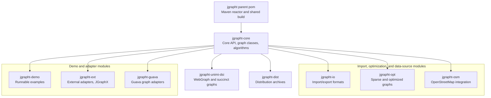
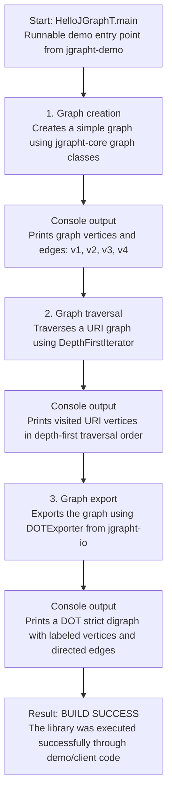

# Phase 1 Report: Repository Setup and Understanding

## Project Information

| Item | Details |
| --- | --- |
| Project | JGraphT |
| Repository type | Open-source Java graph theory library |
| Original repository | <https://github.com/jgrapht/jgrapht> |
| Forked repository | <https://github.com/Avraaaa/jgrapht> |
| Clone command | `git clone https://github.com/jgrapht/jgrapht` |
| Local path | `E:\avra\2-2\dp\opensource\jgrapht` |
| Build system | Multi-module Maven reactor |
| Java requirement | JDK 21 or later |
| Local Java used | Java 25.0.2 |
| Local Maven used | Apache Maven 3.9.16 |

JGraphT is a Java class library for mathematical graph-theory objects and algorithms. It is not a single standalone application with one central user interface or business workflow. Instead, its architecture is library-oriented: client code creates graph instances, applies algorithms or adapters, and optionally imports, exports, visualizes, or packages those graph structures.

For Phase 1, the repository was cloned locally, built using Maven, and executed through the runnable demo entry point `org.jgrapht.demo.HelloJGraphT`. This is appropriate because libraries are normally executed through demo programs, tests, or client code rather than through a single application entry point.

---

## 1. Repository Setup

The original repository was cloned using the following command:

```powershell
 git clone https://github.com/jgrapht/jgrapht
```

A personal fork was also prepared for future pull request work:

```text
https://github.com/Avraaaa/jgrapht
```

The local development environment used Java and Maven. The environment was checked with:

```powershell
java -version
mvn -version
```

Observed Java version:

```text
java version "25.0.2" 2026-01-20 LTS
Java(TM) SE Runtime Environment (build 25.0.2+10-LTS-69)
Java HotSpot(TM) 64-Bit Server VM (build 25.0.2+10-LTS-69, mixed mode, sharing)
```

Observed Maven version:

```text
Apache Maven 3.9.16
Java version: 25.0.2, vendor: Oracle Corporation
OS name: "windows 11", version: "10.0", arch: "amd64", family: "windows"
```

---

## 2. Architecture Overview

The repository is organized as a parent Maven project with nine modules. The parent `pom.xml` manages shared plugin configuration, dependency versions, build lifecycle settings, formatting, Checkstyle, source packaging, Javadocs, and release-related configuration. Each module contributes a focused part of the library.

The `jgrapht-core` module is the architectural center. It defines the main abstractions, common graph implementations, traversal utilities, graph generators, event support, utility classes, and algorithm packages. Other modules extend this core with import/export support, optimized graph representations, external integrations, runnable demonstrations, and distribution packaging.



**Figure 1.** High-level module architecture of the JGraphT Maven reactor. The parent POM coordinates the build, while `jgrapht-core` acts as the central library module extended by import/export, optimization, adapter, demo, and distribution modules.

---

## 3. Core Package and Component Diagram

The core module is the center of the project. It exports the public graph API and the major implementation, algorithm, generation, traversal, event, and utility packages used by the rest of the project.

```mermaid
flowchart TB
    api["org.jgrapht<br/>Public graph API"]

    subgraph main["Main feature packages"]
        graph["org.jgrapht.graph<br/>Concrete graph classes, wrappers, and graph walks"]
        alg["org.jgrapht.alg<br/>Algorithms and algorithm interfaces"]
        traverse["org.jgrapht.traverse<br/>Traversal iterators"]
        generate["org.jgrapht.generate<br/>Graph generators"]
    end

    subgraph support["Support packages"]
        event["org.jgrapht.event<br/>Graph and traversal events"]
        util["org.jgrapht.util<br/>Reusable helper classes"]
    end

    api --> main
    main --> support
```

**Figure 2.** Layered package structure of the `jgrapht-core` module. The public API is exposed through `org.jgrapht`; graph implementations, algorithms, traversals, and generators form the main feature packages; event and utility packages provide supporting infrastructure.

---

## 4. Main Components

### 4.1 `jgrapht-core`

This is the primary module. It exports the `org.jgrapht` API and major subpackages such as `graph`, `alg`, `generate`, `traverse`, `event`, and `util`. Important responsibilities include:

- Defining the core `Graph<V, E>` abstraction and related graph interfaces.
- Providing common graph implementations such as simple graphs, directed graphs, weighted graphs, pseudographs, graph wrappers, and graph walks.
- Providing algorithms for shortest paths, matching, connectivity, coloring, spanning trees, centrality, tours, cuts, flows, clustering, and related graph problems.
- Providing traversal iterators such as depth-first, breadth-first, topological, closest-first, and random walk traversal.
- Providing graph generators for common graph shapes and random graph models.

### 4.2 `jgrapht-io`

This module adds graph import and export support. It depends on `jgrapht-core` and exports packages for formats such as CSV, DOT, GEXF, GML, Graph6, GraphML, JSON, Lemon, matrix, DIMACS, and TSPLIB. It also uses ANTLR for parser-based formats.

### 4.3 `jgrapht-osm`

This module provides OpenStreetMap road-graph integration. It builds graph instances from preprocessed OSM data or GeoPackage sources and includes geographic support such as Haversine heuristics for A* search.

### 4.4 `jgrapht-opt`

This module provides specialized graph implementations optimized for memory or performance. It depends on `jgrapht-core` and uses fastutil for efficient data structures.

### 4.5 `jgrapht-ext`

This module contains adapters for external libraries, especially visualization support through JGraphX.

### 4.6 `jgrapht-guava`

This module adapts Google Guava graph data structures so JGraphT algorithms can operate on Guava-backed graphs.

### 4.7 `jgrapht-unimi-dsi`

This module integrates with WebGraph and succinct data structure libraries from the University of Milan DSI ecosystem. It depends on `jgrapht-core`, `jgrapht-opt`, fastutil, WebGraph, Big WebGraph, dsiutils, sux4j, and Guava.

### 4.8 `jgrapht-demo`

This module contains runnable examples that show how to create graphs, run algorithms, traverse graphs, import/export graph data, and visualize graphs. Its JAR manifest points to `org.jgrapht.demo.JGraphXAdapterDemo`, and it also contains command-line-friendly examples such as `HelloJGraphT`.

### 4.9 `jgrapht-dist`

This module assembles release archives containing library JARs, dependencies, documentation, and source material.

---

## 5. Entry Point and Execution Flow

Because JGraphT is a library, its main execution flow is usually controlled by client code. A typical client workflow is:

1. Create a graph instance using a concrete graph class or `GraphTypeBuilder`.
2. Add vertices and edges.
3. Run traversal, algorithm, import/export, or adapter code.
4. Read results through graph APIs, algorithm result objects, or exported output.

For Phase 1 validation, the runnable example `org.jgrapht.demo.HelloJGraphT` was used because it exercises the main library layers without requiring a GUI.



**Figure 3.** Execution flow of the runnable demo `org.jgrapht.demo.HelloJGraphT`. The demo validates graph creation, graph traversal, and DOT export through JGraphT library components.

The demo flow shows that the core graph model, traversal package, and I/O exporter can work together in one executable path:

- `SimpleGraph` and `DefaultDirectedGraph` come from `jgrapht-core`.
- `DepthFirstIterator` comes from `org.jgrapht.traverse`.
- `DOTExporter` and `DefaultAttribute` come from `jgrapht-io`.
- Output is printed directly to the console.

---

## 6. Build and Run Summary

The local environment was checked and the demo module was built and run. Detailed command evidence is stored separately in `build_and_run_evidence.md`.

### 6.1 Validated Commands

```powershell
java -version
mvn -version
mvn -pl jgrapht-demo -am -DskipTests package
mvn -pl jgrapht-demo "-Dexec.mainClass=org.jgrapht.demo.HelloJGraphT" exec:java
```

### 6.2 Targeted Build

The following Maven command was used to build the demo module and its required upstream modules:

```powershell
mvn -pl jgrapht-demo -am -DskipTests package
```

The command has the following meaning:

- `-pl jgrapht-demo` selects the demo module.
- `-am` also builds the required modules that the demo module depends on.
- `-DskipTests` skips test execution during this setup validation step.
- `package` compiles and packages the selected module and its dependencies.

The observed reactor build order included the parent, core, I/O, ext, and demo modules:

```text
Reactor Build Order:
JGraphT - Parent
JGraphT - Core
JGraphT - I/O
JGraphT - Ext
JGraphT - Demo

JGraphT - Parent ................................... SUCCESS
JGraphT - Core ..................................... SUCCESS
JGraphT - I/O ...................................... SUCCESS
JGraphT - Ext ...................................... SUCCESS
JGraphT - Demo ..................................... SUCCESS

BUILD SUCCESS
```

This confirms that the selected demo module and its required upstream modules were compiled successfully.

### 6.3 Demo Run

After the targeted Maven build succeeded, the next step was to confirm that the repository could actually be executed locally. Since JGraphT is a library rather than a standalone application, it does not open a normal application window. Therefore, the repository was executed through a runnable demo class from the `jgrapht-demo` module.

The selected entry point was:

```text
org.jgrapht.demo.HelloJGraphT
```

This demo was selected because it executes three important parts of the library in one path:

- Graph creation using classes from `jgrapht-core`.
- Graph traversal using `DepthFirstIterator`.
- Graph export using `DOTExporter` from `jgrapht-io`.

The following Maven command was executed from the root of the cloned repository:

```powershell
mvn -pl jgrapht-demo "-Dexec.mainClass=org.jgrapht.demo.HelloJGraphT" exec:java
```

In this command, `-pl jgrapht-demo` tells Maven to run inside the demo module. The argument `-Dexec.mainClass=org.jgrapht.demo.HelloJGraphT` tells the Maven Exec plugin which Java `main()` method should be executed.

The first part of the output shows that the demo created a simple undirected graph and printed its vertices and edges:

```text
-- toString output
([v1, v2, v3, v4], [{v1,v2}, {v2,v3}, {v3,v4}, {v4,v1}])
```

This confirms that the core graph model is working. The graph contains four vertices, `v1`, `v2`, `v3`, and `v4`, and four edges connecting them.

The second part of the output shows a depth-first traversal over a directed graph containing URI-style vertices:

```text
-- traverseHrefGraph output
http://www.jgrapht.org
http://www.wikipedia.org
http://www.google.com
```

This confirms that the traversal API is working. The demo uses JGraphT traversal logic to visit the graph vertices and print them in traversal order.

The third part of the output shows the graph exported in DOT format:

```text
-- renderHrefGraph output
strict digraph G {
  www_google_com [ label="http://www.google.com" ];
  www_wikipedia_org [ label="http://www.wikipedia.org" ];
  www_jgrapht_org [ label="http://www.jgrapht.org" ];
  www_jgrapht_org -> www_wikipedia_org;
  www_google_com -> www_jgrapht_org;
  www_google_com -> www_wikipedia_org;
  www_wikipedia_org -> www_google_com;
}
```

This confirms that the export functionality from `jgrapht-io` can work together with the core graph model. The DOT output represents a directed graph with labeled vertices and directed edges.

Finally, Maven reported successful execution:

```text
BUILD SUCCESS
```

Therefore, the local run was successful. The repository was not only built locally, but also executed through a real demo entry point. This validates that the selected library can run locally through client/demo code, which is the correct execution approach for a Java library project.

---

## 7. Phase 1 Conclusion

The repository is locally usable for Phase 1. Although JGraphT is a library rather than a standalone application, it was successfully built and executed through its demo module. The selected demo validates that the core graph model, traversal API, and graph export API can compile and run together.

The report also documents the project structure, major Maven modules, core package organization, main components, and execution flow. Therefore, the Phase 1 requirements for repository setup and understanding are satisfied.
